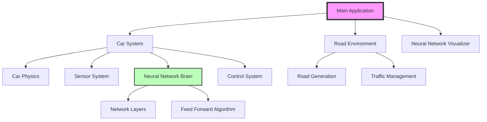
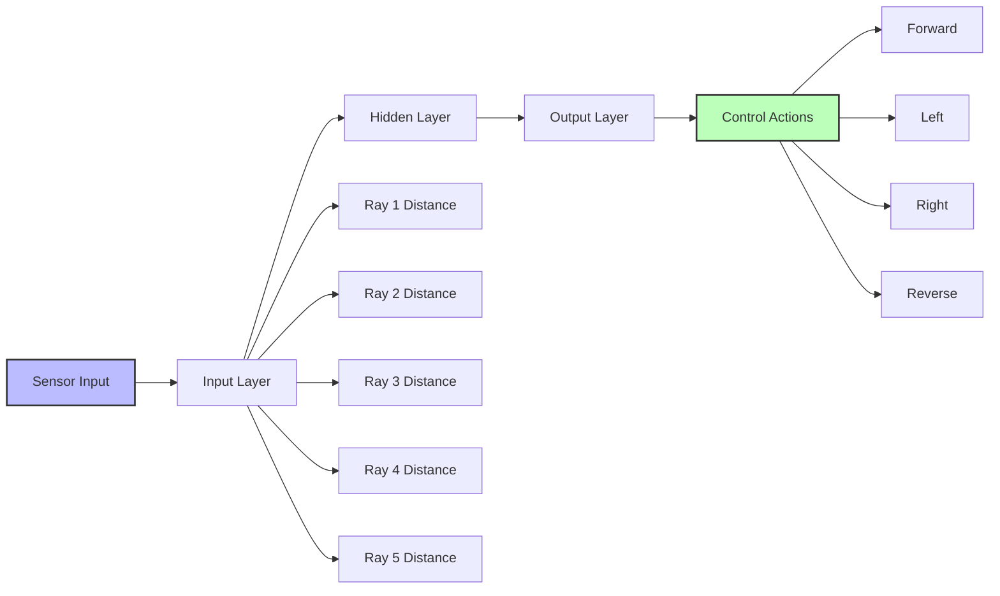
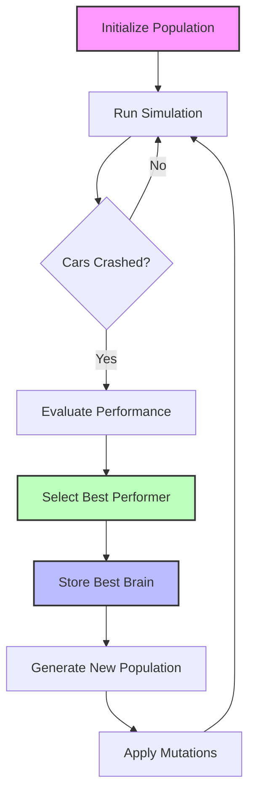
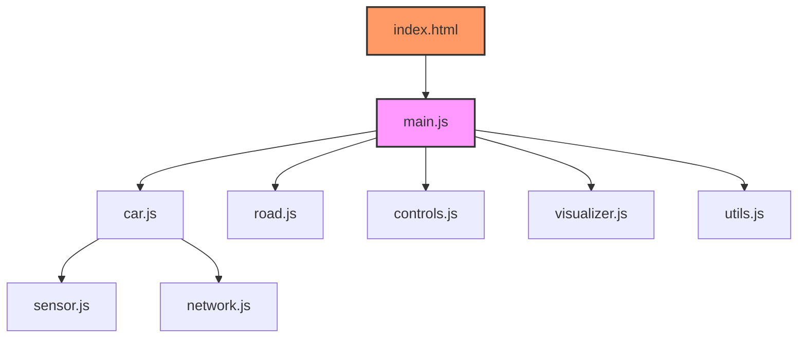
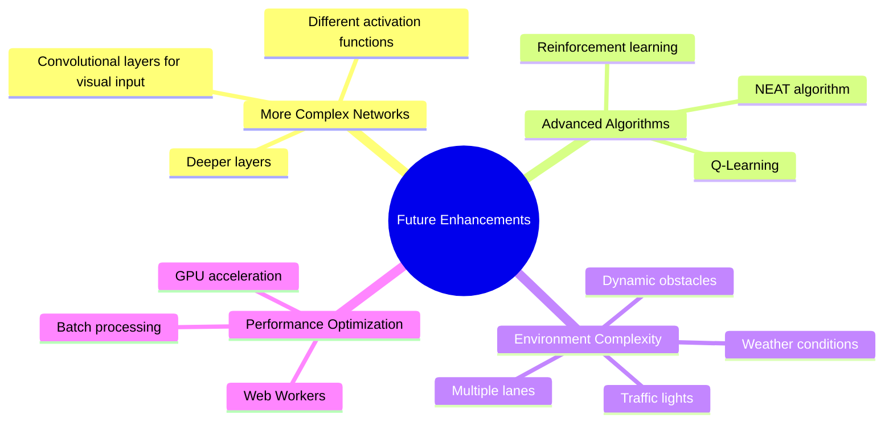

# Self-Driving Car Neural Network Simulation

## Executive Summary

This project implements an AI-powered self-driving car simulation using neural networks and JavaScript. The simulation features 100 parallel AI cars that learn to navigate through a dynamically generated road environment, avoiding obstacles and staying within road boundaries.

## Table of Contents

1. [Project Overview](#project-overview)
2. [Architecture](#architecture)
3. [Key Components](#key-components)
4. [Neural Network Design](#neural-network-design)
5. [Learning Process](#learning-process)
6. [Technical Implementation](#technical-implementation)
7. [Results and Performance](#results-and-performance)
8. [How to Run](#how-to-run)
9. [Future Enhancements](#future-enhancements)
10. [Conclusion](#conclusion)

## Project Overview

This project represents a comprehensive implementation of autonomous vehicle navigation using neural networks. The system simulates multiple self-driving cars simultaneously, each equipped with a neural brain that makes real-time decisions based on sensor input.

### Key Features

- **Real-time Physics Simulation**: Accurate car movement with speed, acceleration, and friction
- **Neural Network Decision Making**: Each car makes autonomous driving decisions
- **Sensor System**: Cars equipped with ray-casting sensors to detect environment
- **Genetic Algorithm**: Population-based learning with mutation for continuous improvement
- **Visual Network Representation**: Real-time visualization of neural network activity
- **Collision Detection**: Complex polygon-based collision system

## Architecture



## Key Components

### 1. Car Model
- Implements realistic physics with acceleration, braking, and steering
- Handles collision detection with road boundaries and other vehicles
- Contains embedded neural network for decision making

### 2. Sensor System
- Ray-casting technology for environment detection
- Configurable number of rays (default: 5)
- Detects distance to nearest obstacles
- Provides normalized input to neural network

### 3. Neural Network
- Feedforward neural network architecture
- Input layer: Sensor readings
- Hidden layers: Processing logic
- Output layer: Control decisions (forward, left, right, reverse)

### 4. Road System
- Dynamic road generation with curves
- Lane management system
- Boundary detection for collision

## Neural Network Design



### Network Architecture
- **Input Layer**: 5 neurons (sensor ray readings)
- **Hidden Layers**: Configurable depth and width
- **Output Layer**: 4 neurons (movement controls)
- **Activation Function**: Binary threshold function

## Learning Process



### Genetic Algorithm Implementation
1. **Population**: 100 cars per generation
2. **Selection**: Best performer based on distance traveled
3. **Mutation**: Random weight adjustments (40% mutation rate)
4. **Persistence**: Best brain saved to localStorage

## Technical Implementation

### Core Technologies
- **Pure JavaScript**: No external frameworks
- **HTML5 Canvas**: Rendering engine
- **Local Storage**: Brain persistence
- **Object-Oriented Programming**: Clean architecture

### File Structure


### Key Algorithms

#### Collision Detection
```javascript
// Polygon intersection algorithm
function polysIntersect(poly1, poly2) {
    // Check each edge of poly1 against each edge of poly2
    // Return true if any edges intersect
}
```

#### Neural Network Feed Forward
```javascript
// Process input through network layers
static feedForward(givenInputs, network) {
    let outputs = Level.feedForward(givenInputs, network.levels[0]);
    for(let i = 1; i < network.levels.length; i++) {
        outputs = Level.feedForward(outputs, network.levels[i]);
    }
    return outputs;
}
```

## Results and Performance

### Simulation Metrics
- **Population Size**: 100 cars per generation
- **Convergence Time**: Varies based on road complexity
- **Success Rate**: Improves with each generation
- **Performance**: Real-time rendering at 60 FPS

### Visual Feedback
- Main canvas: Road and cars
- Network canvas: Real-time neural network visualization
- Best performer highlighted with sensor rays

## How to Run

1. Clone the repository:
   ```bash
   git clone https://github.com/Ismat-Samadov/self_driving_car.git
   ```

2. Navigate to project directory:
   ```bash
   cd self_driving_car
   ```

3. Open `index.html` in a web browser

4. Use browser console commands:
   - `save()` - Save best performing neural network
   - `discard()` - Clear saved neural network

## Future Enhancements



### Potential Improvements
1. **Advanced Neural Architectures**: Implement recurrent networks for temporal awareness
2. **Enhanced Sensors**: Add visual input processing
3. **Complex Environments**: Multiple lanes, intersections, traffic signals
4. **Performance Metrics**: Detailed analytics and learning curves
5. **Multi-agent Cooperation**: Cars that communicate and cooperate

## Conclusion

This self-driving car simulation demonstrates the power of neural networks in solving complex navigation problems. Through evolutionary learning, the cars develop increasingly sophisticated driving behaviors, showcasing the potential of AI in autonomous vehicle technology.

### Key Achievements
- Successfully implemented neural network-based decision making
- Created a robust physics and collision detection system
- Developed an effective genetic algorithm for continuous improvement
- Built a real-time visualization system for neural network activity

### Educational Value
This project serves as an excellent educational tool for understanding:
- Neural network fundamentals
- Genetic algorithms and evolutionary computation
- Real-time simulation and physics
- JavaScript object-oriented programming
